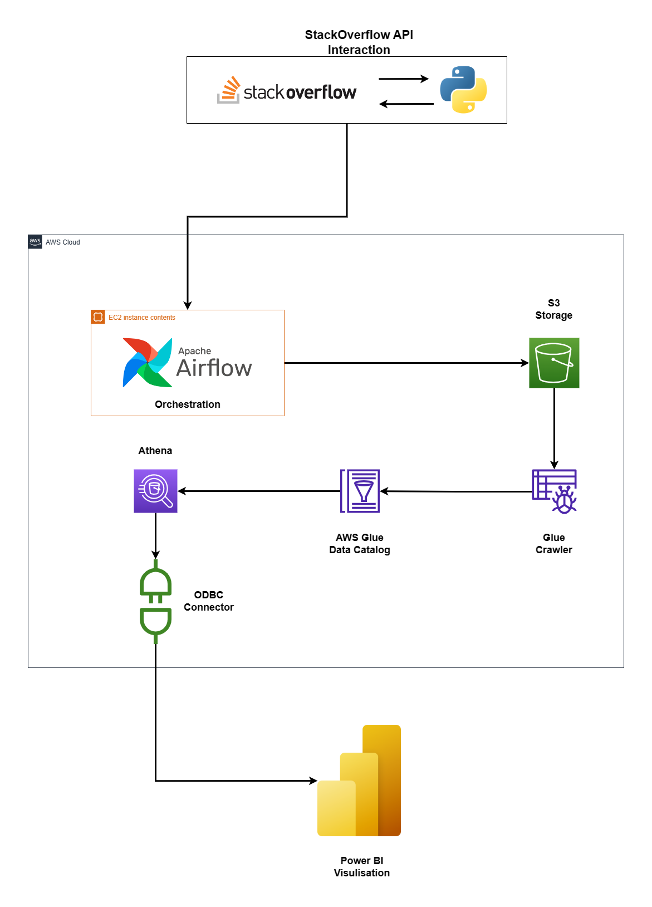

# Packt Task Explanation

In the solution I have used Airflow for orchestrating data ingestion. Airflow has one DAG file which has two task first one to fetch data from API and second one to upload data to s3 bucket. 

Then, Glue crawler will crawl the data to fetch schema and add table to glue database. Now we can use Athena to query our data. At Last the athena gets connected to Power BI application using ODBC where we can plot our data. 